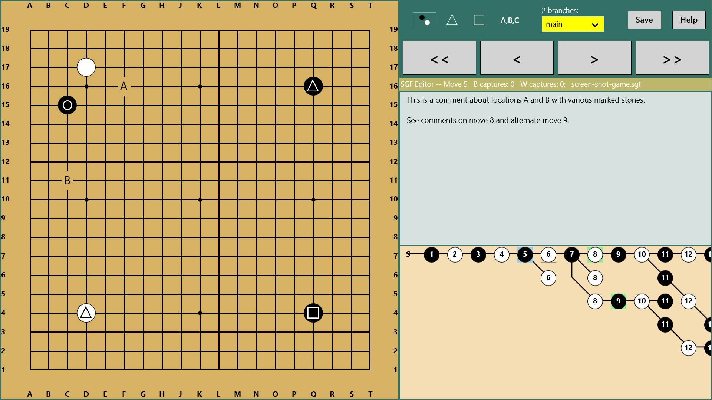
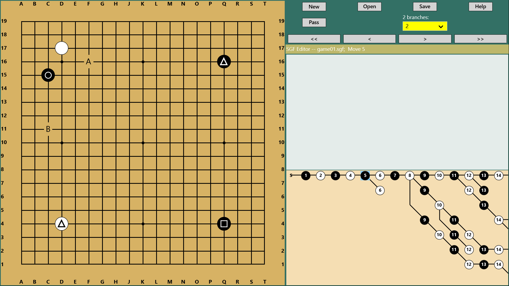

# Project Description

SGF Editor reads and writes .sgf files, edits game trees, etc.  It has several useful commands for reviewing games, including saving in reverse view to give a copy to your opponent.  You can also just use it as a Go board to play a game.  (For search purposes: goban, baduk, weiqi.)

_The project has a Python version (IronPython/WPF required for UI), C#/WPF desktop version, and Windows 8 Windows App Store version.  The Python version is the farthest behind (see sgfpy\notes.txt), and the WPF version is behind by a couple of features, also listed in notes.txt).  I use PTVS to hack on the IPy version.  I use Visual Studio for the C#/WPF and C#/WinRT versions._

The Windows 8 app store page is [here](http://apps.microsoft.com/windows/app/sgfeditor/4770d48e-0179-4ada-a7ed-8382c85d949a).

Here's an image of the win8 app followed by an image of the WPF version (Surface screen res seems too high for uploading screen capture, but if you zoom your browser window, it looks better :-)):

and WPF version ...

## history/status/caveat:

* I started this as an IronPython project to play with WPF and the tooling that later became PTVS.  I then ported to C# for fun and to get ready to convert the WPF UI to Windows 8 WinRT UI.  
* The C# is mostly fine IMO, BUT
0. It still reflects some python-isms (for example, comments refer to python_style_names, there is inadvertent mixed naming style, big static classes for stateless module scoped helper functions, few uses of 'dynamic' instead of interfaces/generics/overloads) and 
0. While I have had one serious C# expert positively review architecture and code, the code style is not the Microsoft C# sample style.  I like K&R style and more comments.

## From the Help command ... (slightly out of date)

PLACING STONES AND ANNOTATIONS:
Click on board location to place alternating colored stones.
Shift click to place square annotations, ctrl click for triangles, and
alt click to place letter annotations.  If you click on an adornment location
twice (for example shift-click twice in one spot), the second click removes
the adornment.

If the last move is a misclick (at the end of a branch), click the last move again to undo it.

KEEPING FOCUS ON BOARD FOR KEY BINDINGS
Escape will always return focus to the board so that the arrow keys work
and are not swallowed by the comment editing pane.  Sometimes opening and
saving files leaves WPF in a weird state such that you must click somewhere
to fix focus.

NAVIGATING MOVES IN GAME TREE
Right arrow moves to the next move, left moves to the previous, up arrow selects
another branch or the main branch, down arrow selects another branch, home moves
to the game start, and end moves to the end of the game following the currently
selected branches.  You can always click a node in the game tree graph.

*win8 version*: If the current move has branches following it, the selected branch's first node has a
light grey square outlining it. Nodes that have comments have a light green
highlight, and the current node has a light blue highlight.

CREATING NEW FILES
The new button (or ctrl-n) prompts for game info (player names, board size,
handicap, komi) and creates a new game.  If the current game is dirty, this prompts
to save.

OPENING EXISTING FILES
The open button (or ctrl-o) prompts for a .sgf file name to open.  If the current
game is dirty, this prompts to save.

SAVING FILES, SAVE AS
The save button (or ctrl-s) saves to the associated file name if there is one;
otherwise it prompts for a filename.  If there is a filename, but the game state
is not dirty, then it prompts to save to a different filename (and tracks to the
new name).  To explicitly get save-as behaivor, use ctrl-alt-s.

SAVING REVERSE VIEW
To save the game so that your opponent can review it from his point of view, use
ctrl-alt-f.  (Would have preferred ctrl-shift-s or alt-s, but WPF was difficult.)

CUTTING MOVES/SUB-TREES AND PASTING
Delete or c-x cuts the current move (and sub tree), making the previous move the
current move.  C-v will paste a cut sub tree to be a next move after the current
move.  If the the sub tree has a move that occupies a board location that already
has a stone, you will not be able to advance past this position.

MOVING BRANCHES
You can move branches up and down in the order in which they show up in the branch
combo, including changing what is the main line branch of the game.  To move a
a branch up, you must be on the first move of a branch, and then you can use
ctrl-uparrow, and to move a branch down, use ctrl-downarrow.

PASSING
The Pass button or c-p will make a pass move.

F1 produces this help.

There is an auto save feature if Windows suspends the app and also every 30s.
Opening a file that has a newer auto save file prompts for which to open.  Launching
the app checks for an unnamed auto save file less than 12 hours old.
